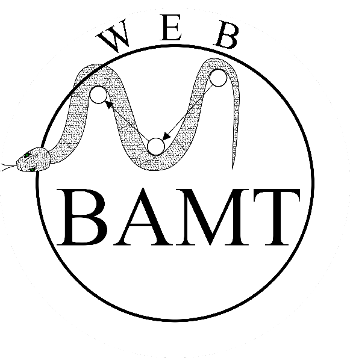

Web-Bamt
==========

.. start-badges
.. list-table::
   :stub-columns: 1

   * - team
     - | |ITMO| |NCCR|
   * - tests
     - | |coverage|
   * - docs
     - |docs|
   * - license
     - | |license|
   * - mirror
     - |mirror|

Online tool for Bayesian Networks based on BAMT package

Frontend: TypeScript

Backend: Python, SQLite

The main concept
^^^^^^^^^^^^^^^^^

This tool is intended for the analysis of multidimensional distributions by building Bayesian networks, the structure of which is a directed acyclic graph, and the edges show the dependencies between features (nodes). The algorithmic core of the tool is a BAMT library. This core allows any user to build their own Bayesian networks on tabular data of any nature.

Main features:

1. Building network structures based on data using various algorithms;
2. Assignment of expert knowledge in the process of learning networks;
3. Training of distribution parameters in network nodes;
4. Support for various data types (discrete, continuous);
5. Generation of synthetic data;
6. Modularity, extensibility, integrability with ML tools;
7. Combination of a lightweight API for the end user and advanced configuration for research applications.

Features in development:

1. Loading your own training dataset;
2. Define regression and classification models in parametric learning;
3. Development of advanced distribution analytics and visual comparison of different networks.

A more detailed description of the algorithms can be found `here <https://github.com/aimclub/Web-BAMT/wiki/About-BAMT-algorithms>`_.

How to use
^^^^^^^^^^^

If you want to train your Bayesian network on your data, first install the package ``pip install bamt``

Then the necessary classes are imported from the library:

``import bamt.Networks as Nets``

Next, a network instance is created and training (structure and parameters) is performed:

``bn = Nets.HybridBN(has_logit=False, use_mixture=True)``

``bn.add_edges(discretized_data,  scoring_function=('K2',K2Score))``

``bn.fit_parameters(data)``

More examples can be found `here <https://github.com/ITMO-NSS-team/BAMT/tree/master/tutorials>`_.

Web demo
^^^^^^^^^

However, if you just want to evaluate the possibilities of working with different parameters of Bayesian network learning algorithms, then you can use the `web demo <http://bamt.aim.club/>`_, which allows you to work with existing examples and has analytics tools. This functionality was made due to the limited computing capabilities of the server.

If you want to use the web demo for your projects, then you can run the web service locally on your server and make some changes to the code. Detailed instructions are `here <https://github.com/ITMO-NSS-team/Web-BAMT/wiki/Local-Setup>`_. You can also find rules for formatting input files `there <https://github.com/ITMO-NSS-team/Web-BAMT/wiki/Local-Setup>`_.

At the moment, the web demo is only accessible from the ITMO University network. A video demonstrating the web service can be found `here <https://youtu.be/2w6dRHlzVzs>`_.

Documentation
^^^^^^^^^^^^^^

More information about BAMT and Web-BAMT can be found `here <https://web-bamt.readthedocs.io/en/latest/>`_.

Contacts
^^^^^^^^^

If you have questions or suggestions, you can contact us at the following address: `ideeva@itmo.ru <mailto:ideeva@itmo.ru>`_ (Irina Deeva)

Our Team
^^^^^^^^^

Irina Deeva - Project Manager;

Roman Netrogolov - Backend developer;

Karine Shakhkyan - development of logic for working with composite BN in a web service;

Anna Bubnova - development of the algorithmic core of the project;

Yuri Kaminsky - developer of the algorithmic core of the project;

Citation
^^^^^^^^^

@article{deeva2023advanced,
    title={Advanced Approach for Distributions Parameters Learning in Bayesian Networks with Gaussian Mixture Models and Discriminative Models},
    author={Deeva, Irina and Bubnova, Anna and Kalyuzhnaya, Anna V},
    journal={Mathematics},
    volume={11},
    number={2},
    pages={343},
    year={2023},
    publisher={MDPI}}

@article{kaminsky2022bigbravebn,
    title={BigBraveBN: algorithm of structural learning for bayesian networks with a large number of nodes},
    author={Kaminsky, Yury and Deeva, Irina},
    journal={Procedia Computer Science},
    volume={212},
    pages={191--200},
    year={2022},
    publisher={Elsevier}}

@article{bubnova2022approach,
    title={Approach of variable clustering and compression for learning large Bayesian networks},
    author={Bubnova, Anna and Deeva, Irina},
    journal={Procedia Computer Science},
    volume={212},
    pages={275--283},
    year={2022},
    publisher={Elsevier}}

.. |docs| image:: https://readthedocs.org/projects/web-bamt/badge/?version=latest
    :target: https://web-bamt.readthedocs.io/en/latest/?badge=latest
    :alt: Documentation Status

.. |ITMO| image:: https://raw.githubusercontent.com/ITMO-NSS-team/open-source-ops/cd771018e80e9164f7b661bd2191061ab58f94de/badges/ITMO_badge.svg

.. |NCCR| image:: https://raw.githubusercontent.com/ITMO-NSS-team/open-source-ops/cd771018e80e9164f7b661bd2191061ab58f94de/badges/NCCR_badge.svg

.. |license| image:: https://img.shields.io/github/license/AimClub/Web-BAMT
   :alt: Supported Python Versions
   :target: https://github.com/aimclub/Web-BAMT/blob/main/LICENCE.md

.. |coverage| image:: https://codecov.io/gh/aimclub/Web-BAMT/branch/main/graph/badge.svg?token=1JUNI5I5LW
   :target: https://codecov.io/gh/aimclub/Web-BAMT

.. |mirror| image:: https://camo.githubusercontent.com/9bd7b8c5b418f1364e72110a83629772729b29e8f3393b6c86bff237a6b784f6/68747470733a2f2f62616467656e2e6e65742f62616467652f6769746c61622f6d6972726f722f6f72616e67653f69636f6e3d6769746c6162
   :target: https://gitlab.actcognitive.org/itmo-nirma-code/Web-BAMT

