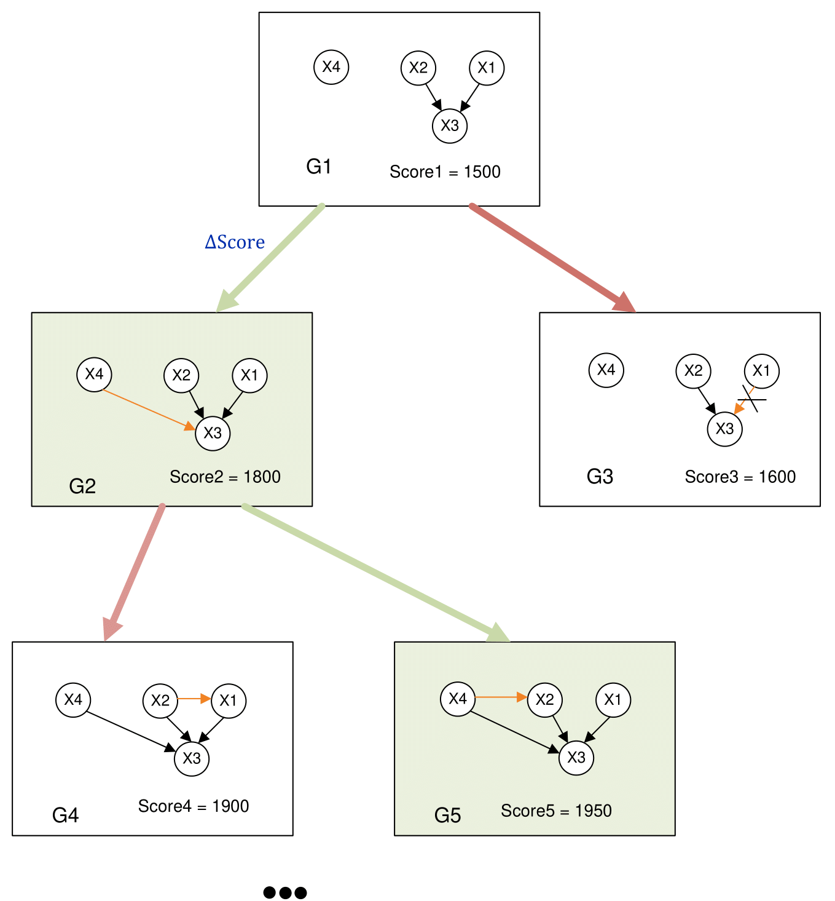
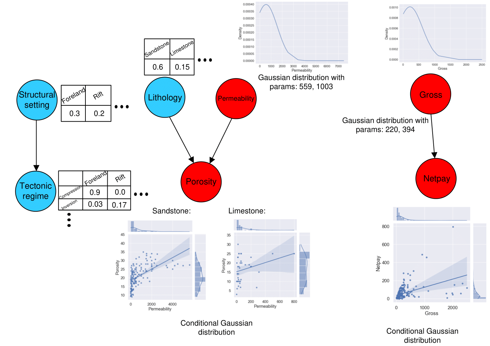

About BAMT algorithms
======================

Web-BAMT is a web service that allows you to train Bayesian networks on demonstration
examples on data of various nature.

Introduction to Bayesian networks
+++++++++++++++++++++++++++++++++

A Bayesian network is a pair of directed acyclic graph (DAG) describing the dependencies
of characteristics and some factorization of the joint distribution of characteristics
in the product of conditional, generated by these dependencies. Below is an example
of a Bayesian network and how a multivariate distribution is factorized according to
the structure of the Bayesian network

The task of training a Bayesian network is thus split into two subtasks:

* Finding the structure of the Bayesian network.
* Parametric learning of the Bayesian network or, in other words, selection of marginal and conditional distributions that describe the conditional ones accurately enough.

Structural learning algorithms
++++++++++++++++++++++++++++++

Often the task of constructing a network is reduced to optimization:

.. math::
    V_{opt}, E_{opt}=\underset{G' \subset G_{possible}}{argmax}F(G')

In the DAG space, score functions are introduced that evaluate how well
the graph describes the dependencies between features. Web BAMT uses
the Hill-Climbing algorithm to search in this space. Steps of Hill-Climbing
algorithm:

1. Initialized by a graph without edges;
2. For each pair of nodes, an edge is added, removed or the direction is changed;
3. The score-function value is counted after the selected action on the pair;
4. If the value of score-function is better than that of the previous iteration, the result is memorized;
5. Stops when the value changes less than the threshold value.

The following score functions from
`BAMT package <(https://github.com/ITMO-NSS-team/BAMT)>`_
are included in Web BAMT: K2, BIC (Bayesian Information Criterion),
MI (Mutual Information).

The above approach to structure search allows to introduce elements of expert
control by narrowing the search area to structures that include expert-specified
edges or fixed root nodes describing key and basic features. Also, our web service
allows you to train connections from continuous to discrete nodes, in this case
modeling distributions using classification models (for this you need to set the
Logit parameter to True).

Parametric learning algorithms
++++++++++++++++++++++++++++++

Parametric learning of distributions is performed by the method of
likelihood maximization in a fixed class of distributions.

In classical Bayesian networks, at the nodes of a Bayesian network, distributions are
represented either using conditional probability tables (for discrete nodes) or using
Gaussian distributions and linear regressions (for continuous nodes). However, such
a classical approach to modeling conditional distributions may not always be
effective since the data is not always modeled by linear regressions. That is why,
within the framework of this web service, the ability to work with composite
Bayesian networks was added.

Parametric learning algorithms for composite Bayesian networks
+++++++++++++++++++++++++++++++++++++++++++++++++++++++++++++++

The core of the representation of Bayesian networks is a directed acyclic graph,
however, in the composite setting, this core is extended by two types of vertices, namely
``G={V,M,E}`` where *G* is the structure of the composite Bayesian network, *V* is a set
of variable nodes within which a probability distribution is modeled, *M* is a set of
model nodes that are machine learning models and link variable nodes, *E* is a set of
directed edges. Therefore, for example, if two variable nodes are continuous, then they
can be connected by any machine learning model that can solve the regression problem.
Then the parameters of the conditional continuous distribution for the connection of nodes
*X* and *Y* of the form *X → m → Y* will be calculated as follows:

.. math::
    μ_{X|Y} = m(x),

    var_{X|Y} = (m(x)-y)^2,

where *μ, var* is the mean and variance of the conditional distribution, *m* is the
machine learning model node that links the variable nodes *X* and *Y.*

Therefore, as part of working with the web service, the user can choose a machine learning
model for both continuous nodes and discrete ones to model conditional distributions in
the nodes. This approach more accurately reproduces conditional distributions with
non-linear dependencies between nodes.

Sampling algorithms
+++++++++++++++++++

Sampling in Bayesian networks is done top-down according to the topological order.
For the root nodes, the parametric model describes the distribution from which the
random value is to be obtained. For discrete ones this is a multinomial discrete
distribution, for continuous ones it is a Gaussian distribution or a mixture of Gaussian
distributions. Once the values for the root vertices are obtained, all the following
distributions are conditional on the values in the parent vertices.

For discrete values, these will also be random values obtained according to the table of
conditional distributions estimated from the data in the case of discrete parents or
obtained from the classification model if at least one parent is continuous. In the
continuous case, the distribution parameters for sampling are obtained using gaussian
mixture regression (GMR). If the simple option is chosen, such a model will be degenerate
and will have only one mixture element.

For composite models, sampling is performed by predicting the conditional mathematical
expectation or conditional probabilities from the selected machine learning model.

