Examples
========

Example methodology description
++++++++++++++++++++++++++++++++

Both examples consider the following combinations of hyperparameters used for Bayesian network learning:

* K2 metric;
* K2 metric with gaussian mixtures (GMM);
* K2 metric with GMM and logit nodes;
* K2 with initial structure.

All the examples are executed using cross-validation, 
the data is preproccesed as follows:

.. code-block:: python

    data.dropna(inplace=True)
    data.reset_index(inplace=True, drop=True)
    
    encoder = preprocessing.LabelEncoder()
    discretizer = preprocessing.KBinsDiscretizer(n_bins=5, encode='ordinal', strategy='quantile')

    p = pp.Preprocessor([('encoder', encoder), ('discretizer', discretizer)])

    discretized_data, est = p.apply(train)

Geological data example
++++++++++++++++++++++++

Data Description
------------------

The data set contains 9 variables with 442 samples. The target variable 
for prediction in the following example is 'Depth'. The variable is also 
used to visually evaluate sampling quality via distribution plot.

Sampling and corresponding network structure
--------------------------------------------

K2 metric sampling example
--------------------------

To sample using K2 metric the following code can be used:

.. code-block:: python

    train, validation = train_test_split(data, test_size=0.1)
    bn = Nets.HybridBN(has_logit=False, use_mixture=False)
    bn.add_nodes(info)
    bn.add_edges(discretized_data,  scoring_function=('K2',K2Score))
    bn.fit_parameters(train)
    # prediction
    val_pred = bn.predict(validation.iloc[:,:8], 5)
    # sampling
    sample = bn.sample(5000, parall_count=5)

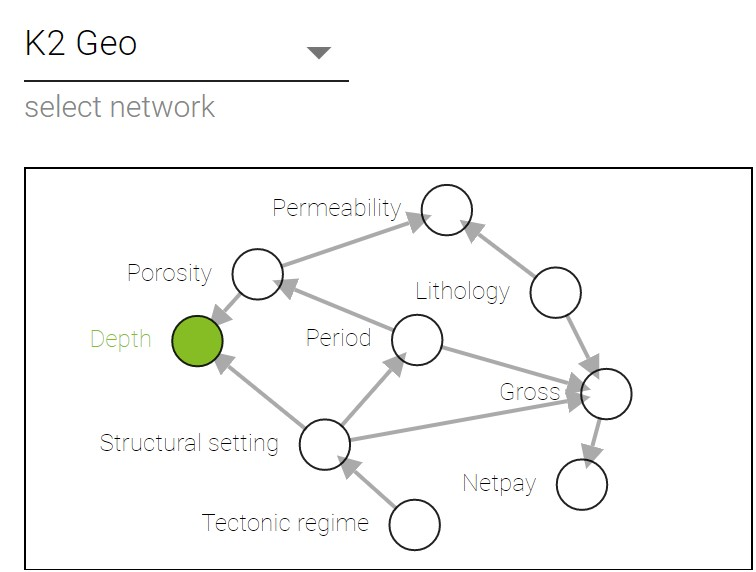

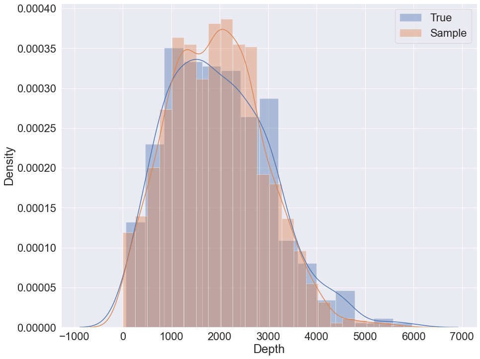

Sampling with K2 + GMM example
-------------------------------

To sample using K2 with GMM the following code can be used:

.. code-block:: python

    train, validation = train_test_split(data, test_size=0.1)
    bn = Nets.HybridBN(has_logit=False, use_mixture=True)
    bn.add_nodes(info)
    bn.add_edges(discretized_data,  scoring_function=('K2',K2Score))
    bn.fit_parameters(train)
    # prediction
    val_pred = bn.predict(validation.iloc[:,:8], 5)
    # sampling
    sample = bn.sample(5000, parall_count=5)

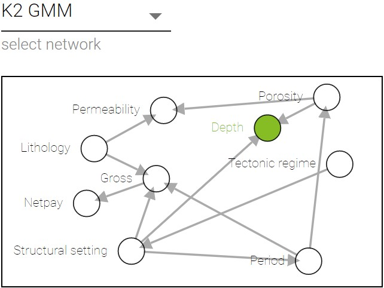

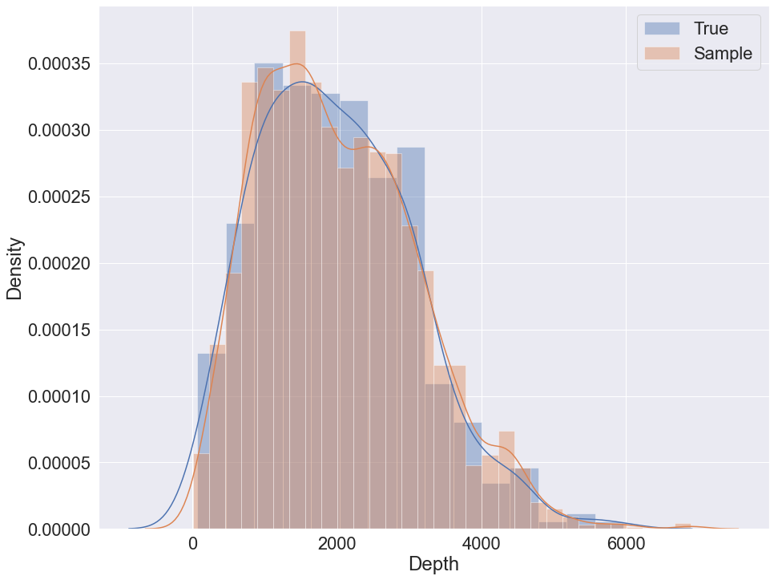

Sampling with K2 + GMM + logit nodes example
---------------------------------------------

To sample using K2 with GMM and logit nodes the following code can be used:

.. code-block:: python

    train, validation = train_test_split(data, test_size=0.1)
    bn = Nets.HybridBN(has_logit=True, use_mixture=True)
    bn.add_nodes(info)
    bn.add_edges(discretized_data,  scoring_function=('K2',K2Score))
    bn.fit_parameters(train)
    # prediction
    val_pred = bn.predict(validation.iloc[:,:8], 5)
    # sampling
    sample = bn.sample(5000, parall_count=5)

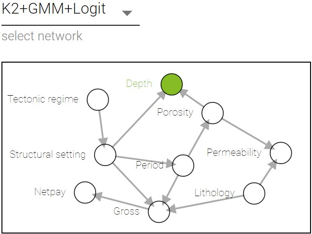

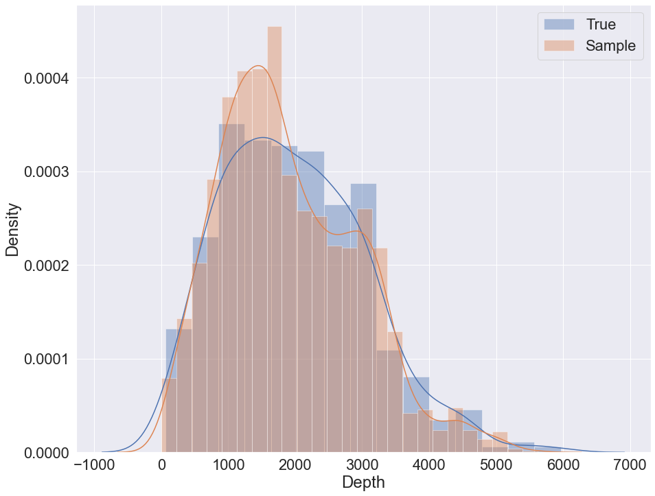

K2 with initial structure sampling
----------------------------------

To sample using K2 and initial structure the following code can be used:

.. code-block:: python
    
    params = {'init_nodes': ['Tectonic regime', 'Period', 'Lithology', 'Structural setting', 'Gross','Netpay', 'Porosity','Permeability', 'Depth'],
        'init_edges':[('Period', 'Permeability'), ('Structural setting', 'Netpay'), ('Gross', 'Permeability')],}

    train, validation = train_test_split(data, test_size=0.1)
    bn = Nets.HybridBN(has_logit=True, use_mixture=True)
    bn.add_nodes(info)
    bn.add_edges(discretized_data,  scoring_function=('K2',K2Score), params=params)
    bn.fit_parameters(train)
    # prediction
    val_pred = bn.predict(validation.iloc[:,:8], 5)
    # sampling
    sample = bn.sample(5000, parall_count=5)

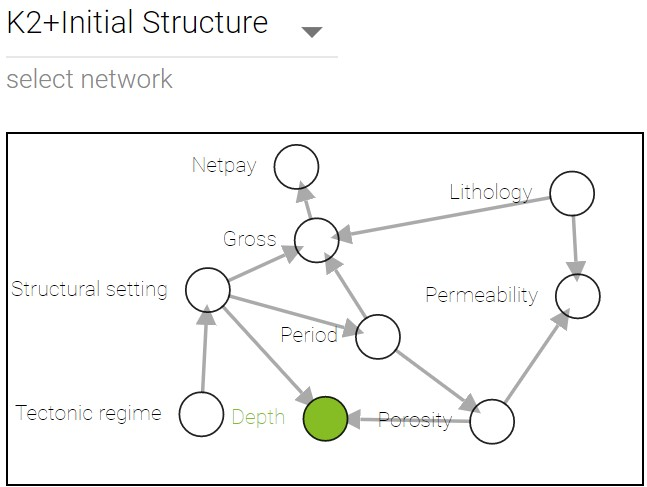

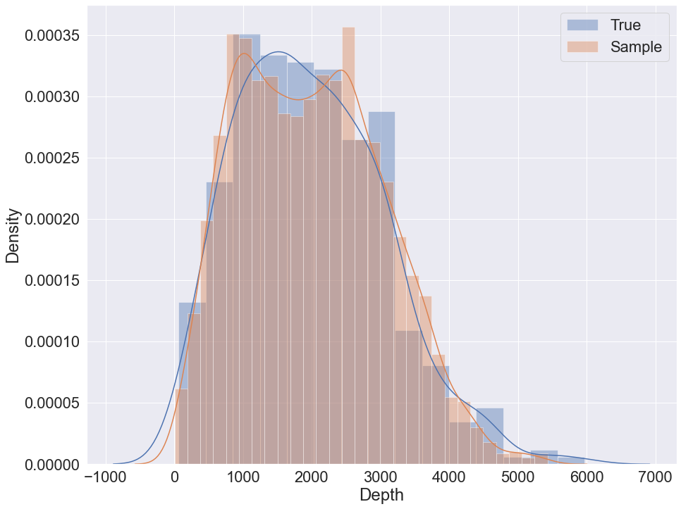

Social data example
++++++++++++++++++++

Data Description
----------------

The second example is similar to the previous one, but carried out 
on different data set. Social data set consists of 30000 anonymous bank 
records with 9 variables each, bayesian networks were learnt on a sample 
with 2000 records. The target variable is 'mean_tr' which is mean 
transaction of client.

Sampling
---------
The code used to sample from social data set is identical 
to the geological dataset.

K2 metric sampling example
---------------------------

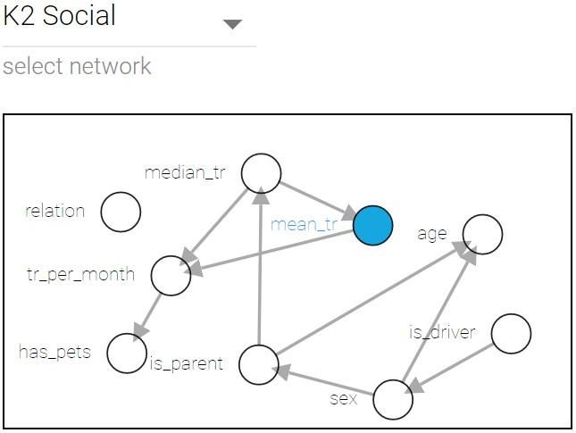

.. image:: img/K2_Social_density.png

Sampling with K2 + GMM example
-------------------------------

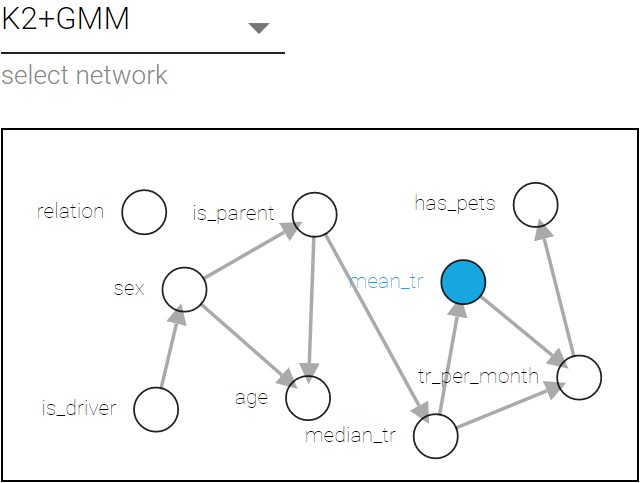

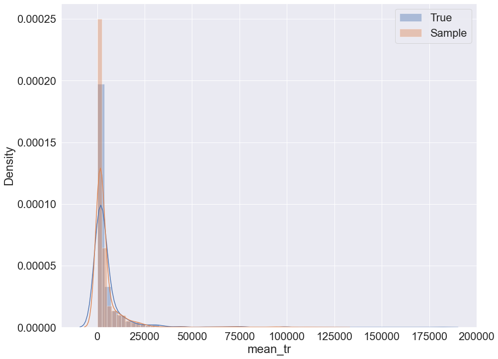

Sampling with K2 + GMM + logit nodes example
--------------------------------------------
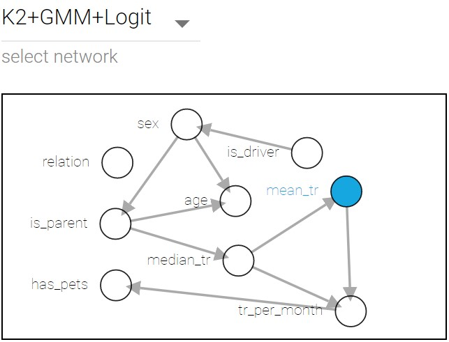

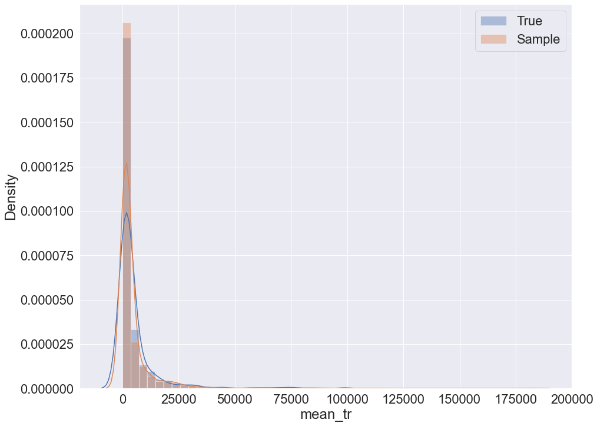

K2 with initial structure sampling
-----------------------------------
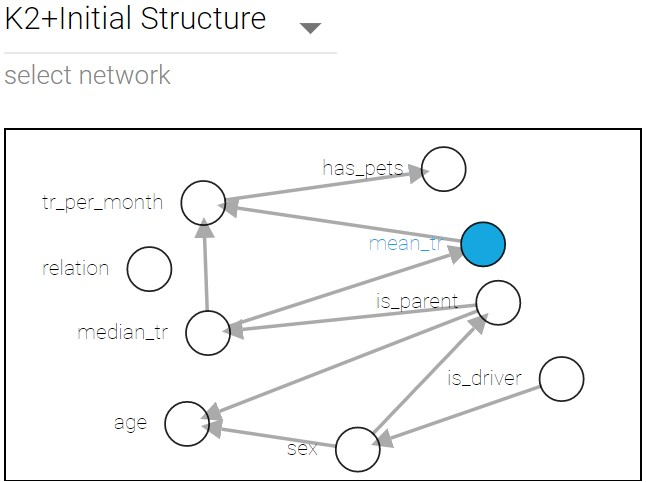
    
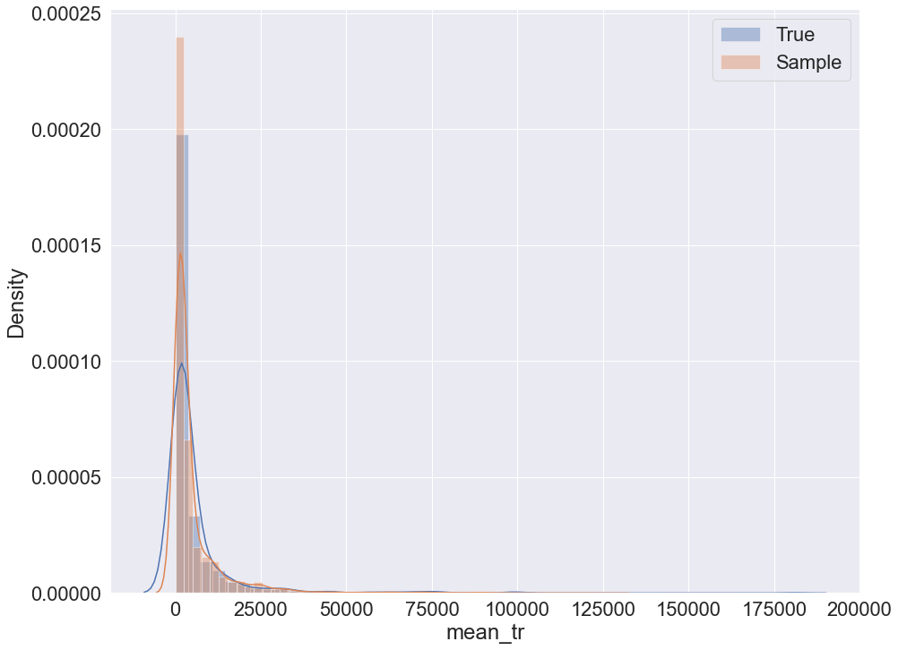

Prediction MSE table for both examples
+++++++++++++++++++++++++++++++++++++++

=============================  =====================  ===============
Hyperparameters combinations   Geological data MSE	  Social data MSE
=============================  =====================  ===============
K2	                           1014.59	              6066.5
K2 + GMM                       	974.35	              5149.5
K2 + GMM + logit               1018.84                6657.93
K2 + initial structure         1056.06                12506.47
=============================  =====================  ===============

