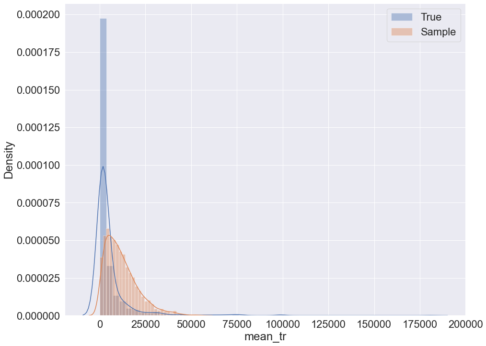
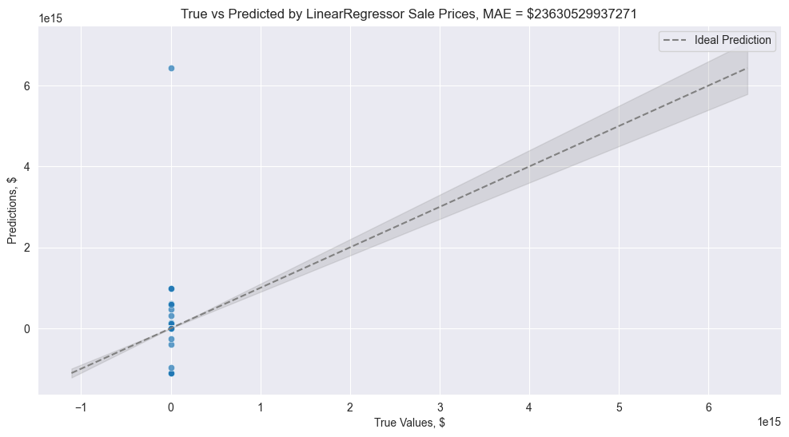
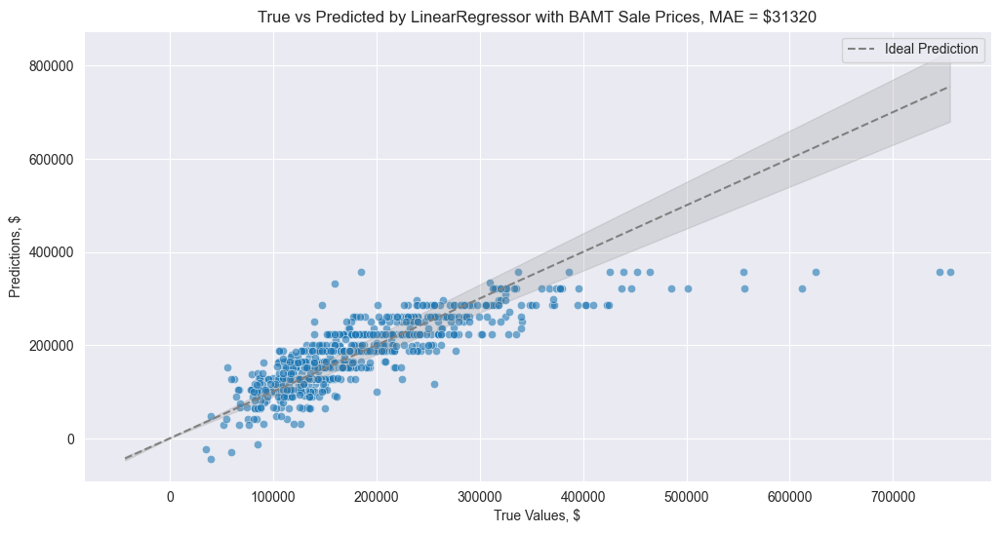
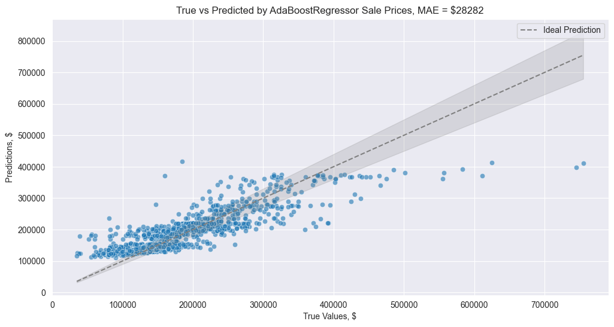
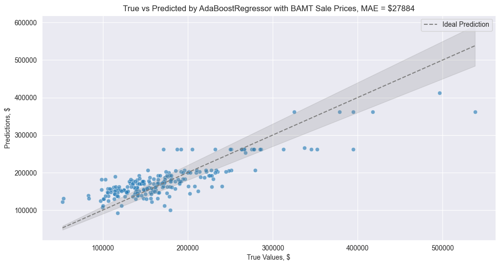

Examples
========

Example methodology description
++++++++++++++++++++++++++++++++

Both examples consider the following combinations of hyperparameters used for Bayesian network learning:

* K2 metric;
* K2 metric with gaussian mixtures (GMM);
* K2 metric with GMM and logit nodes;
* K2 with initial structure.

All the examples are executed using cross-validation, 
the data is preproccesed as follows:

.. code-block:: python

    data.dropna(inplace=True)
    data.reset_index(inplace=True, drop=True)
    
    encoder = preprocessing.LabelEncoder()
    discretizer = preprocessing.KBinsDiscretizer(n_bins=5, encode='ordinal', strategy='quantile')

    p = pp.Preprocessor([('encoder', encoder), ('discretizer', discretizer)])

    discretized_data, est = p.apply(train)

Geological data example
++++++++++++++++++++++++

Data Description
------------------

The data set contains 9 variables with 442 samples. The target variable 
for prediction in the following example is 'Depth'. The variable is also 
used to visually evaluate sampling quality via distribution plot.

Sampling and corresponding network structure
--------------------------------------------

K2 metric sampling example
--------------------------

To sample using K2 metric the following code can be used:

.. code-block:: python

    train, validation = train_test_split(data, test_size=0.1)
    bn = Nets.HybridBN(has_logit=False, use_mixture=False)
    bn.add_nodes(info)
    bn.add_edges(discretized_data,  scoring_function=('K2',K2Score))
    bn.fit_parameters(train)
    # prediction
    val_pred = bn.predict(validation.iloc[:,:8], 5)
    # sampling
    sample = bn.sample(5000, parall_count=5)

.. image:: img/K2_Geo.jpg
    :height: 564
    :width: 706
    :scale: 50

.. image:: img/K2_Geo_density.png

Sampling with K2 + GMM example
-------------------------------

To sample using K2 with GMM the following code can be used:

.. code-block:: python

    train, validation = train_test_split(data, test_size=0.1)
    bn = Nets.HybridBN(has_logit=False, use_mixture=True)
    bn.add_nodes(info)
    bn.add_edges(discretized_data,  scoring_function=('K2',K2Score))
    bn.fit_parameters(train)
    # prediction
    val_pred = bn.predict(validation.iloc[:,:8], 5)
    # sampling
    sample = bn.sample(5000, parall_count=5)

.. image:: img/K2_gmm.jpg
    :height: 564
    :width: 706
    :scale: 50

.. image:: img/K2_gmm_density.png

Sampling with K2 + GMM + logit nodes example
---------------------------------------------

To sample using K2 with GMM and logit nodes the following code can be used:

.. code-block:: python

    train, validation = train_test_split(data, test_size=0.1)
    bn = Nets.HybridBN(has_logit=True, use_mixture=True)
    bn.add_nodes(info)
    bn.add_edges(discretized_data,  scoring_function=('K2',K2Score))
    bn.fit_parameters(train)
    # prediction
    val_pred = bn.predict(validation.iloc[:,:8], 5)
    # sampling
    sample = bn.sample(5000, parall_count=5)

.. image:: img/K2_gmm_logit.jpg
    :height: 564
    :width: 706
    :scale: 50

.. image:: img/K2_gmm_logit_density.png

K2 with initial structure sampling
----------------------------------

To sample using K2 and initial structure the following code can be used:

.. code-block:: python
    
    params = {'init_nodes': ['Tectonic regime', 'Period', 'Lithology', 'Structural setting', 'Gross','Netpay', 'Porosity','Permeability', 'Depth'],
        'init_edges':[('Period', 'Permeability'), ('Structural setting', 'Netpay'), ('Gross', 'Permeability')],}

    train, validation = train_test_split(data, test_size=0.1)
    bn = Nets.HybridBN(has_logit=True, use_mixture=True)
    bn.add_nodes(info)
    bn.add_edges(discretized_data,  scoring_function=('K2',K2Score), params=params)
    bn.fit_parameters(train)
    # prediction
    val_pred = bn.predict(validation.iloc[:,:8], 5)
    # sampling
    sample = bn.sample(5000, parall_count=5)

.. image:: img/K2_initial_structure.jpg
    :height: 564
    :width: 706
    :scale: 50

.. image:: img/K2_initial_structure_density.png 

Social data example
++++++++++++++++++++

Data Description
----------------

The second example is similar to the previous one, but carried out 
on different data set. Social data set consists of 30000 anonymous bank 
records with 9 variables each, bayesian networks were learnt on a sample 
with 2000 records. The target variable is 'mean_tr' which is mean 
transaction of client.

Sampling
---------
The code used to sample from social data set is identical 
to the geological dataset.

K2 metric sampling example
---------------------------

.. image:: img/K2_Social.jpg
    :height: 564
    :width: 706
    :scale: 50

Sampling with K2 + GMM example
-------------------------------

.. image:: img/K2_gmm_Social.jpg
    :height: 564
    :width: 706
    :scale: 50

.. image:: img/K2_gmm_density_Social.png

Sampling with K2 + GMM + logit nodes example
--------------------------------------------
.. image:: img/K2_gmm_logit_Social.jpg
    :height: 564
    :width: 706
    :scale: 50

.. image:: img/K2_gmm_logit_density_Social.png

K2 with initial structure sampling
-----------------------------------
.. image:: img/K2_initial_structure_Social.jpg
    :height: 564
    :width: 706
    :scale: 50
    
.. image:: img/K2_initial_structure_density_Social.png

Prediction MSE table for both examples
+++++++++++++++++++++++++++++++++++++++

=============================  =====================  ===============
Hyperparameters combinations   Geological data MSE	  Social data MSE
=============================  =====================  ===============
K2	                           1014.59	              6066.5
K2 + GMM                       	974.35	              5149.5
K2 + GMM + logit               1018.84                6657.93
K2 + initial structure         1056.06                12506.47
=============================  =====================  ===============

House Prices Dataset examples: Feature analysis and Data Sampling
+++++++++++++++++++++++++++++++++++++++++++++++++++++++++++++++++

In this example we will use
`house prices dataset from kaggle <https://www.kaggle.com/competitions/house-prices-advanced-regression-techniques>`_
that contains multiple categorical and continuous features.
The target variable is, obviously, the price of a house.

Feature analysis example
------------------------

We will try to improve prediction results of LinearRegressor by using Bayesian Networks,
with the assumption that we have a lack of samples and poor data,
for example, only 40% of what we have in the original dataset.

To take a look at this example more precisely,
`please click here. <https://gist.github.com/jrzkaminski/50805963ca02ca8a326e344ea39e592c>`_

Initially, LinearRegressor cannot fit the model, that is why we get a result below

But after we learn the model only on predictors that are parent nodes of the label variable,
LinearRegressor manages to provide a far better result

Synthetic data sampling example
-------------------------------

We will try to improve prediction results of adaboost regressor by using Bayesian Networks.
We will have to drop some of continuous data because
BAMT has some limitations when lots of continuous columns are present,
sampling will take a lot of time.
We also had to drop some columns to make total number of features 20,
so that the inference of BN time will be fast enough to run this example on any hardware without waiting for too long.

To take a look at this example more precisely,
`please click here. <https://gist.github.com/jrzkaminski/ca4c9ef9292ef0e8df4da5b81effae1e>`_

AdaBoostRegressor already has a decent result on the data

But we can improve it using synthetic data generated by BAMT

