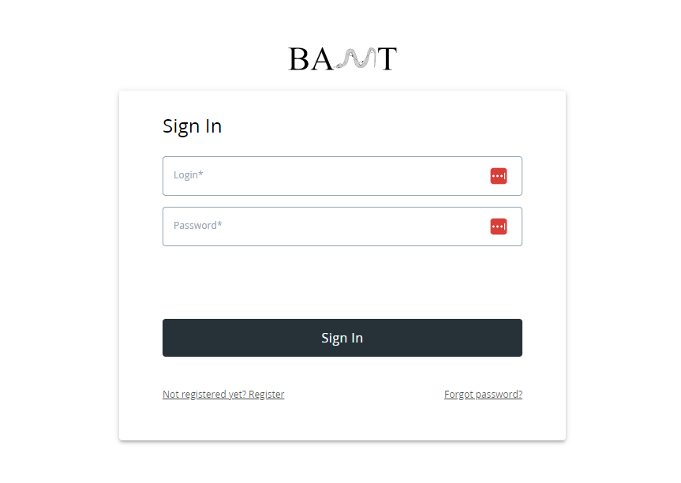
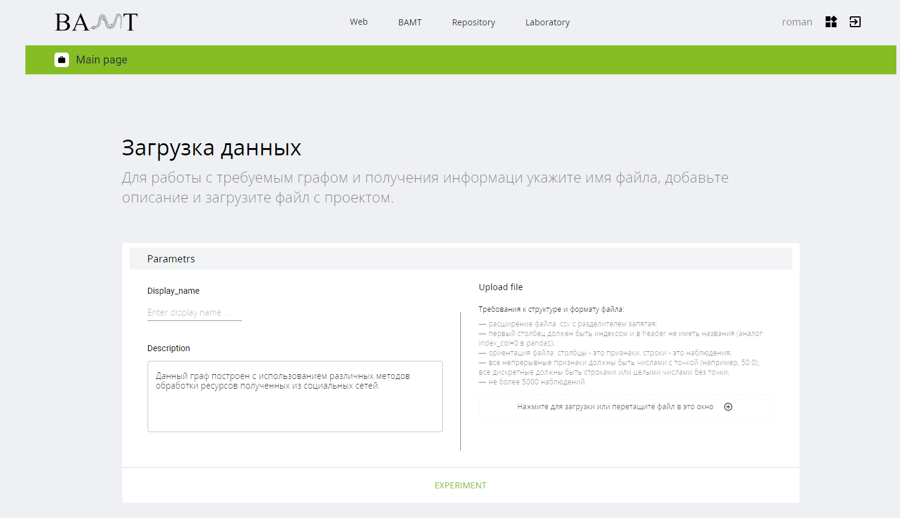
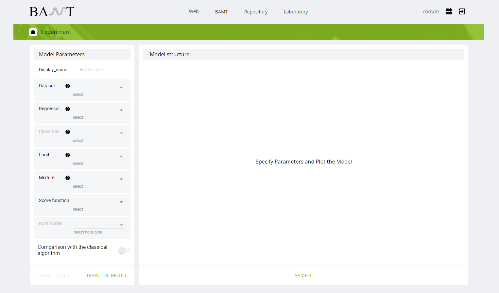
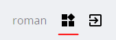
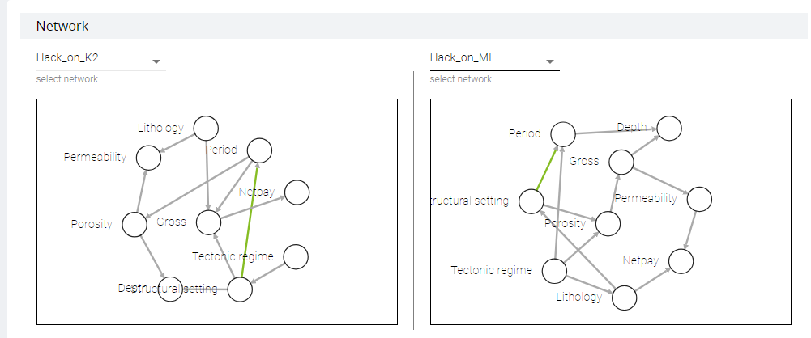
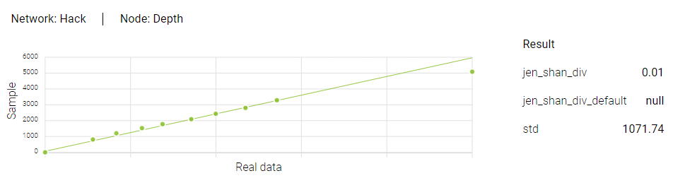
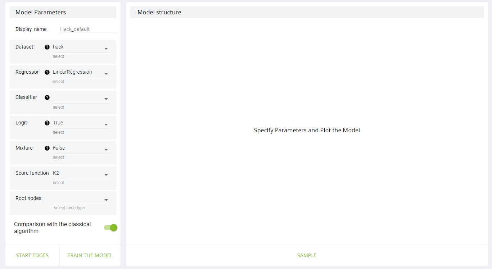
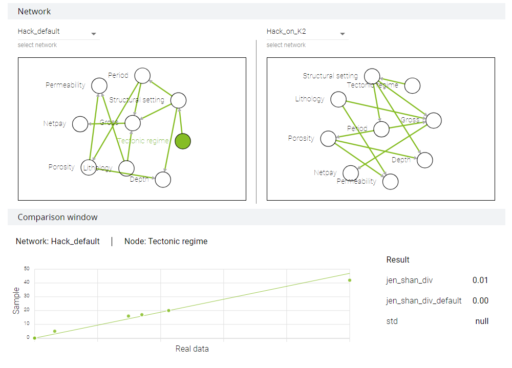
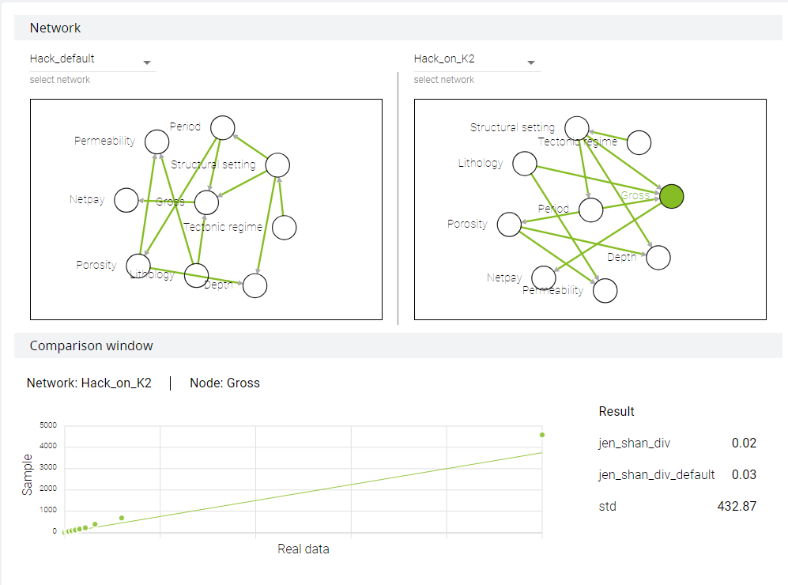

User guide
==============

Intro
++++++

| This is the manual for WebBAMT,
| framework for data modeling and analysis tool based on Bayesian networks.
| As a core for WebBAMT BAMT is used.

| All projects are open-sourced:
| WebBAMT: https://github.com/aimclub/Web-BAMT
| BAMT: https://github.com/aimclub/BAMT

Registration / Sign in
++++++++++++++++++++++++

| If you already have an account, you can pass your data in the fields.
| If not, you can sign up with the forms on link in "Not registered yet? Register".

Dataset upload
+++++++++++++++

| Next you will be redirected on a page with dataset upload.

.. warning::
    Please, take into consideration a format for file below "Upload file".

| Pass a display name, it is a name for your dataset (it must be unique).
| You can also provide a description of your dataset.

| It is also possible, to proceed next without upload your own dataset. In this case you can use build-in datasets.

| After all fields are filled, press on green experiment button!

Experiment
++++++++++++

| On experiment page you choose parameters for bayessian network.
| Let's take a look a little bit closer on them:

Brief description
******************
.. list-table:: Experiment parameters
   :header-rows: 1

   * - Parameter
     - Description
   * - Display name
     - Name of bayessian network.
   * - Dataset
     - Dataset to train on.
   * - Regressor (only if Mixture = False)
     - Model for gaussian node. Affects only parameters learning.
   * - Classifier (only if logit = True)
     - Model for logit node. Affects both parameters and structure learning.
   * - Logit
     - Defines whether use logit nodes or not.
       When True, presence of edges from continuous nodes to discrete is allowed.
   * - Mixture
     - Defines whether use nodes with mixtures or not.
   * - Score Function
     - Function for structure learning.
   * - Root nodes
     - Nodes to start structure learning from.
   * - Comparison with classical algorithm
     - | If True, bayessian network with default parameters will be learnt.
       | Default parameters:

            1. Regressor is LinearRegression.
            2. Logit = False.
            3. Mixture = False.
            4. Score function = K2.
            5. Other parameters are empty.

| After parameters are chosen, you can also set initial structure (domain knowledge) by clicking on "Start Edges" button.
| And then click first on node from edges starts and then on node where edge ends. To delete edge click on it.

| So all that's left is only to press on "Train the model".

Managing datasets and networks
*******************************

| So, now you have a dataset(-s) and network(-s).
| If you want to delete any of them, click on button on the right of your name in the upper right corner.

Sample
+++++++

| This page provides comparison of networks structures and their parameters.

| Let's compare two networks. One of them we have trained with K2 scoring function,
| and the second - with MI (Mutual Information). We haven't set "compare with classical algorithm".

| As you can see, structures are different. The only edge is the same among networks is colored in green.

| By clicking on nodes, you can see result of sampling. We use QQ-plots to compare quantiles:
| on x-axis - quantiles from dataset, on y-axis - quantiles from distribution recovered with bayessian network.

| On the right of plot you can see metrics to evaluate bayessian network.

Metrics
********

| Depending on type of random variable, metrics are displayed. If variable is discrete, only two metrics are shown
| (jen_shan_div and jen_shan_div_default). If continuous, std is shown also.

| Jensen–Shannon divergence is a metric that shows you a unsimilarity between real and predicted. It ranges from 0 to 1.
| Metrics with postfix _default is a metric on default network.

Default networks
*****************

| This feature allows user to find out if variation of parameters helps or not.
| Default sample is cached.

| Let's turn back into experiment page. It can be done in two ways:
| by clicking on experiment button on Sample page or by using navigation bar (BAMT -> Experiment).

| We will train the third network with K2 and logit nodes and with comparison flag.

| Default network is cached, so it can be used for analysis all networks that were trained on dataset.

Concluding word
++++++++++++++++

Gathering all together, with WebBAMT user can:

    1. Upload his own dataset.
    2. Train bayessian networks on it with different parameters.
    3. Compare results of structure and parameters learning.