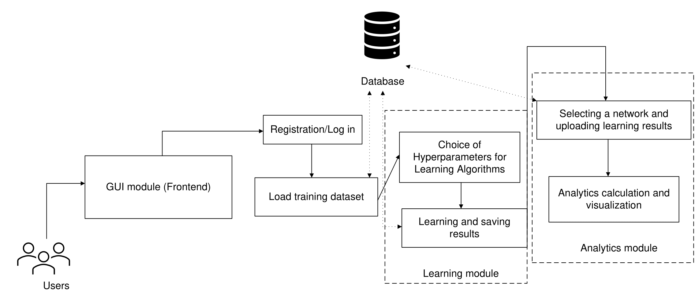

.. index documentation master file, created by
   sphinx-quickstart on Fri Jan 27 14:47:22 2023.
   You can adapt this file completely to your liking, but it should at least
   contain the root `toctree` directive.

Welcome to Web-BAMT’s documentation!
=====================================

This site contains main documentation for the 
`Web-BAMT <https://github.com/aimclub/Web-BAMT/>`_.

The main goal of this product is to provide scientific, technical, and subject specialists
with convenient tools for building composite probabilistic models, as well as performing
analytics based on them (feature selection, analysis of conditional distributions,
generation of synthetic data).

.. toctree::
   :maxdepth: 1

   About_BAMT_algorithms/index.rst
   Local_setup
   Examples/index.rst
   Project_structure
   User_guide

Indices and tables
==================

* :ref:`genindex`
* :ref:`modindex`
* :ref:`search`

